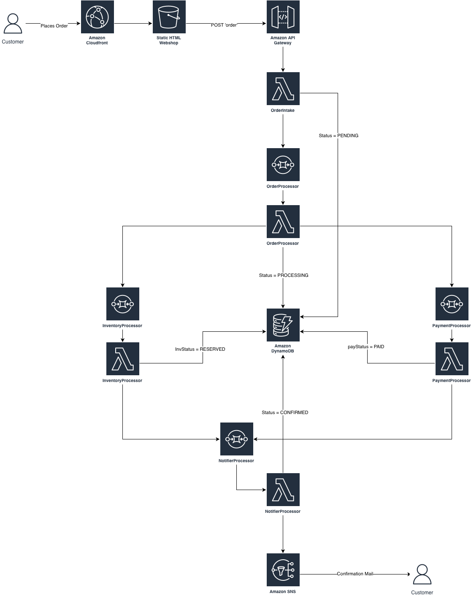

# E-Commerce Order Processing System

Serverless e-commerce application for sneaker orders built with AWS and Terraform.

## Architecture



**Frontend**: Static HTML (S3 + CloudFront)  
**API**: API Gateway REST API  
**Backend**: 5 Lambda functions orchestrated via SQS  
**Database**: DynamoDB  
**Notifications**: SNS

## Components

### Lambda Functions
- **OrderIntake**: Receives orders from API Gateway, writes to DynamoDB (status: PENDING)
- **OrderProcessor**: Processes orders, triggers inventory and payment checks (status: PROCESSING)
- **InventoryProcessor**: Validates inventory (inventoryStatus: RESERVED)
- **PaymentProcessor**: Processes payments (paymentStatus: PAID)
- **Notifier**: Confirms order and sends SNS notification (status: CONFIRMED)

### Infrastructure
- **CloudFront + S3**: Static website hosting with HTTPS
- **API Gateway**: REST API endpoint (`POST /order`)
- **SQS**: 4 main queues + 4 Dead Letter Queues
- **DynamoDB**: Orders table with order status tracking
- **SNS**: Order confirmation notifications
- **IAM**: Lambda execution roles with least privilege policies
- **CloudWatch Logs**: Lambda execution logs

## Project Structure

```
EcommerceProject/
├── terraform/              # Infrastructure as Code
│   ├── provider.tf         # AWS provider (eu-central-1)
│   ├── backend.tf          # S3 backend for state
│   ├── dynamodb.tf         # Orders table
│   ├── sqs.tf              # 4 queues + 4 DLQs
│   ├── lambda.tf           # 5 Lambda functions + event mappings
│   ├── iam.tf              # Roles & policies
│   ├── api_gateway.tf      # REST API with CORS
│   ├── s3_cloudfront.tf    # Static website hosting
│   ├── sns.tf              # Notification topic
│   └── output.tf           # API & CloudFront URLs
├── LambdaFunctions/        # Python Lambda code
├── Frontend/               # Static HTML website
├── Diagram/                # Architecture diagram
└── .github/workflows/      # CI/CD pipeline

```

## Prerequisites

- AWS Account
- Terraform >= 1.14
- AWS CLI configured
- GitHub account (for CI/CD)

## Deployment

### 1. Clone Repository
```bash
git clone <repo-url>
cd EcommerceProject
```

### 2. Configure Backend
Update `terraform/backend.tf` with your S3 bucket name.

### 3. Deploy Infrastructure
```bash
cd terraform/
terraform init
terraform apply
```

### 4. Get Outputs
```bash
terraform output
```

Outputs:
- `api_url`: API Gateway endpoint
- `cloudfront_url`: Website URL
- `dynamodb_table_name`: Orders table
- `sns_topic_arn`: Notification topic

## CI/CD

GitHub Actions workflow for manual deployments:
- **Workflow**: `.github/workflows/terraform.yml`
- **Trigger**: Manual via GitHub UI ("Run workflow")
- **State**: Stored in S3 backend (`juwu-terraform-state-bucket`)

## Order Flow

1. Customer places order via CloudFront website
2. API Gateway → OrderIntake Lambda
3. OrderIntake writes order to DynamoDB (status: PENDING)
4. OrderIntake sends message to OrderProcessor SQS
5. OrderProcessor triggers Inventory + Payment queues (status: PROCESSING)
6. InventoryProcessor updates inventoryStatus: RESERVED
7. PaymentProcessor updates paymentStatus: PAID
8. Both send messages to Notifier SQS
9. Notifier confirms order (status: CONFIRMED) and sends SNS notification

## Testing

### API Test (Postman/curl)
```bash
curl -X POST https://<api-url>/prod/order \
  -H "Content-Type: application/json" \
  -d '{
    "customerId": "customer-123",
    "items": [
      {"productId": "prod-001", "quantity": 2, "price": 29.99}
    ],
    "totalAmount": 59.98
  }'
```

### Website Test
Open CloudFront URL in browser and place an order.

## Monitoring

- **CloudWatch Logs**: `/aws/lambda/<function-name>`
- **DynamoDB Console**: Check order status updates
- **SQS Console**: Monitor queue depths and DLQs

## Cleanup

```bash
cd terraform/
terraform destroy
```

## Tech Stack

- **IaC**: Terraform
- **Cloud**: AWS (Lambda, API Gateway, S3, CloudFront, DynamoDB, SQS, SNS, IAM, CloudWatch)
- **Runtime**: Python 3.13
- **CI/CD**: GitHub Actions
- **Region**: eu-central-1

## Security

- S3 bucket private, accessed only via CloudFront OAC
- API Gateway CORS configured for CloudFront domain
- Lambda execution roles with least privilege policies
- DynamoDB encryption at rest (default)
- HTTPS enforced via CloudFront

## Cost Optimization

- CloudFront PriceClass_100 (US/EU only)
- No VPC (no NAT Gateway costs)
- SQS standard queues (not FIFO)
- DynamoDB on-demand pricing
- Lambda with minimal memory allocation